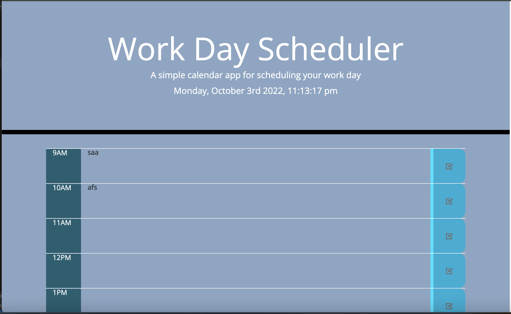

## Personal Work Day Schedule

## Description
    This personal work day schedule helps the user track down important activites within their day. The user can edit the time slots to add text 

## Usage
    The usage of a workday schedular is to keep track of upcoming events or activites throughout the day and store them to view later on

## Features 
    -Current Time
    -Text Editor
    -Save Button

## ScreenShots
 

## Link

## License
    MIT License